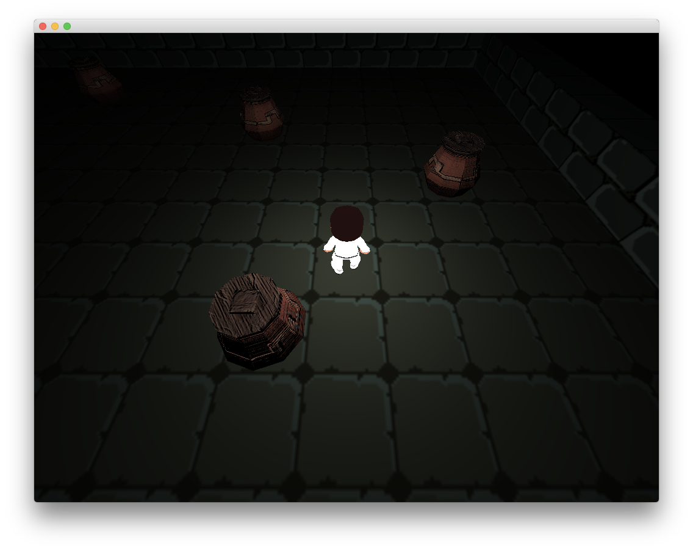

Tiny 3D engine
==============

This is a very small but functional 3D engine. Currently this 3D engine can be run on MacOS using Metal API,
but support for Win32 and Vulkan is under development.

Engine supports rendering of static and animated meshes with custom textures and shaders. Demo game is
included in the project.

Simple asset pipeline tool is included in `Source/Importer` and is configured with the `Resources/assets.xml` file.
The tool is automatically run during the build process. For the simplicity, pipeline tool embeds asset data directly
into the executable file. This allows to avoid writing I/O support for the price of inconvenience
and bloated executable size. Also, texture data is stored uncompressed. Do not use this engine for big projects!

Engine includes simple resource manager to avoid loading multiple textures or meshes twice. As assets are
embedded into the executable, resource manager uses data pointers as keys for caching data. In proper game engine
you would rather use string identifiers (e.g. file names) or hashes and don't rely on memory addresses.

Screenshots
-----------

